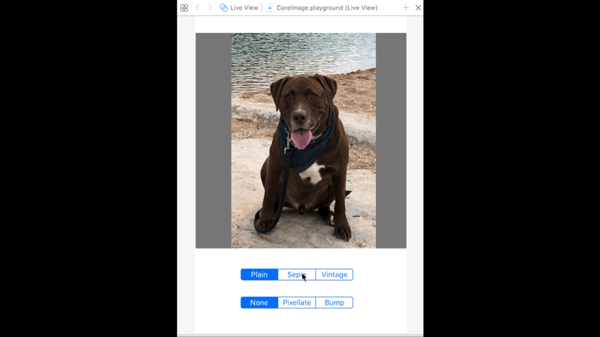

This playground demonstrates some uses of Apple's `CoreImage` framework, particularly filters and transforms. Some of the UIImage extensions contained here are the base for functionality in my [Sticker Lab](https://itunes.apple.com/us/app/sticker-lab-create-your-own/id1407374447?ls=1) app.

I'm using a picture of my chocloate lab, Chip, and giving the option to apply a couple of color filters and distortion filters by selecting them in segmented controls. For the distortion filters, pixellate and bump distortion, a series of frames are created and animated to show the effect over time.

Sticker Lab takes this a step further, creating animated gifs and converting them to stickers to share via iMessage.

